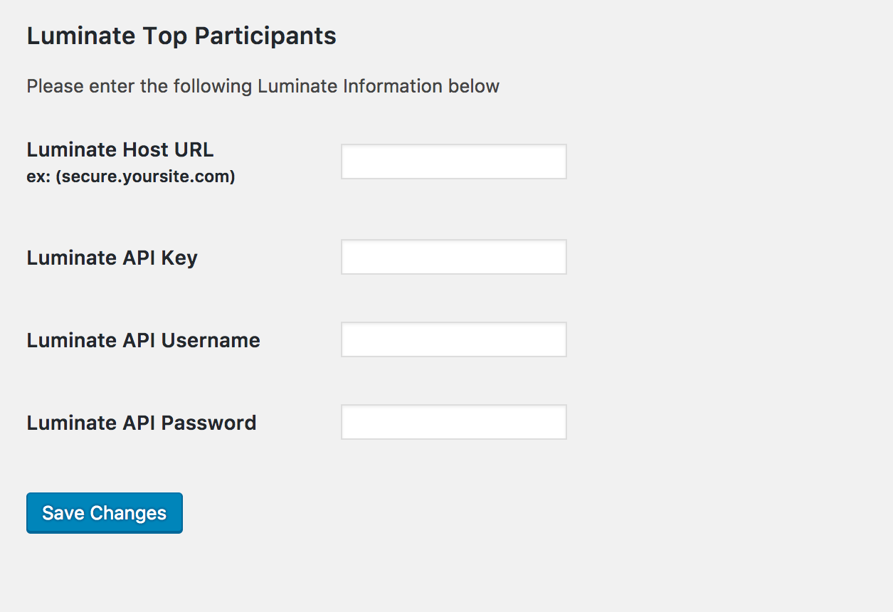

# top-participants
A Wordpress Plugin for showing top participants, teams and groups from the Luminate API

## Description

Finally an easy way to show your Blackbaud Luminate Online Top Participants information on your wordpress website.  You can add your top participants, teams and custom participant types using shortcodes. Plugin uses Luminate Online’s API to safely grab that information and give you the power to show it as you wish!

## Example Usage

`[top_participants type="XXXX" output="XXXX" class="XXXX" event_id="XXXX" limit="XXXX" title="XXXX" filter_text="XXXX"]`

## Default Arguments

**type** = participants | teams | crew
**output** = table | list  
**class** = "whatever you want it to be"  
**id** = "whatever you want it to be  
**event_id** = fr_id  
**filter_text** = the "participant type" inside your Teamraiser for a particular event (ONLY FOR CREW)
**limit** = <10 (apparently their API ONLY gives you up to 10) 
**title** = "whatever you want it to be and gets wrapped in an h2 with the class of "type"_header so IE: participants_header 

## Installation

1. Download and unzip the most recent version of this plugin
2. Upload the luminate-top-participants folder to /path-to-wordpress/wp-content/plugins/
3. Login to your WP Admin panel, click Plugins, and activate "Luminate Top Participants"

## Frequently Asked Questions
1. Do I need a Luminate Online account to run this?
> Yes. You need a working Luminate Online account since you will need to get vital information from the system.

2. Can I grab the total amount of donations received?
> Currently it does not, but I will work on that.

## Screenshots == 

## Changelog ==
1.1
* Removed those participants that have their account set to private within Luminate from showing up in the Top Lists
